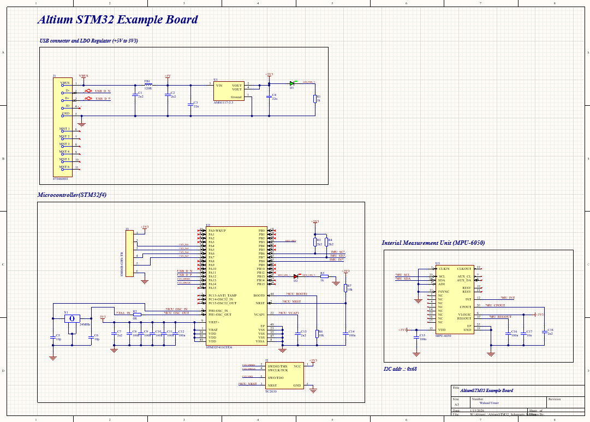
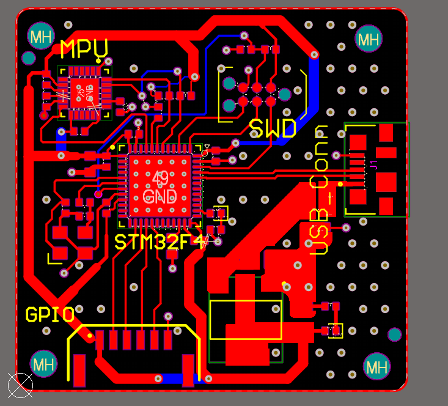
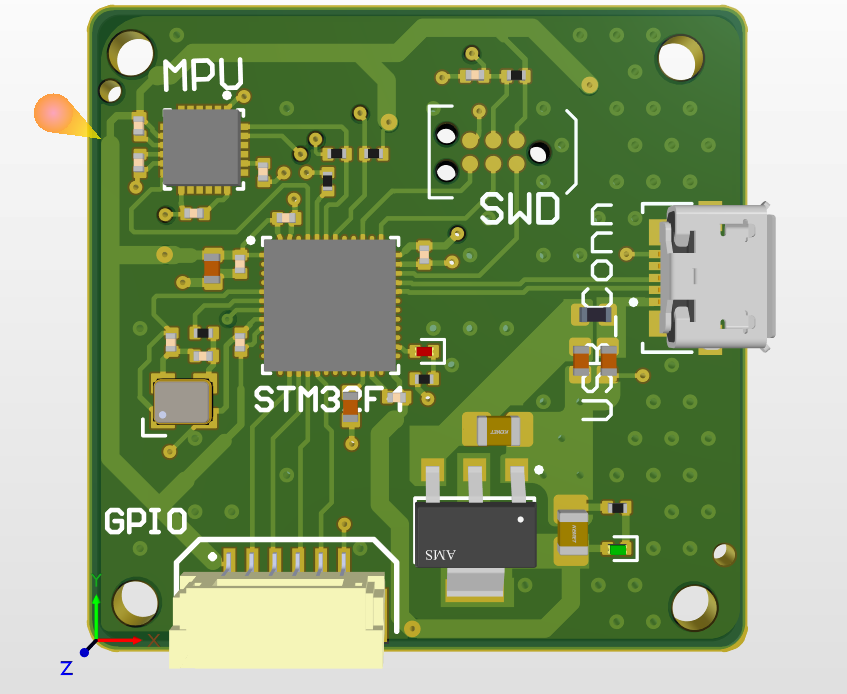

<h3>🔌 Advanced PCB Design Project</h3>

- <b><a href="https://github.com/WaleedUmer357/Advanced-PCB-Design-AltiumSTM32f4/tree/main">Advanced 4-Layer STM32F4 PCB Design</a></b>
  - Professional 4-layer PCB design featuring STM32F4 microcontroller
  - <a href="https://github.com/WaleedUmer357/Advanced-PCB-Design-AltiumSTM32f4">Altium Project Files</a> | <a href="https://github.com/WaleedUmer357/Advanced-PCB-Design-AltiumSTM32f4/tree/main/Project%20Outputs%20for%20AltiumSTM32_ExamplePCB">Gerber Files</a> | <a href="https://github.com/WaleedUmer357/Advanced-PCB-Design-AltiumSTM32f4/tree/main/Project%20Outputs%20for%20AltiumSTM32_ExamplePCB">BOM</a>
  
  

  
🎨 Click to view Project Details

   
  
  <h4>🚀 Project Overview</h4>
  
This project showcases an advanced 4-layer PCB design developed in Altium Designer, featuring the powerful STM32F4 microcontroller. The design incorporates professional-grade routing techniques, power management, USB connectivity, GPIO expansion, and an integrated Inertial Measurement Unit (MPU-6050) for motion sensing applications. This board is designed for high-performance embedded systems requiring precise signal integrity and robust power distribution.

  
  <h4>✨ Key Features</h4>
  <ul>
    <li><b>Microcontroller:</b> STM32F4 series - High-performance ARM Cortex-M4 core</li>
    <li><b>PCB Layers:</b> 4-layer stackup for optimal signal integrity and power distribution</li>
    <li><b>Power Management:</b> 
      <ul>
        <li>USB-powered design with LDO voltage regulator (5V to 3.3V)</li>
        <li>Efficient power distribution across all layers</li>
        <li>Decoupling capacitors strategically placed for noise reduction</li>
      </ul>
    </li>
    <li><b>Connectivity:</b>
      <ul>
        <li>USB Type-C connector for programming and power</li>
        <li>SWD (Serial Wire Debug) interface for debugging</li>
        <li>GPIO header for external peripherals</li>
      </ul>
    </li>
    <li><b>Sensors:</b> MPU-6050 Inertial Measurement Unit (6-axis gyroscope + accelerometer)</li>
    <li><b>Design Tools:</b> Altium Designer with professional DRC and signal integrity checks</li>
  </ul>
  
  <h4>🎯 Design Highlights</h4>
  
  
<b>🔴 Layer Stackup & Routing</b>

  <ul>
    <li><b>Layer 1 (Top):</b> Signal routing with components placement</li>
    <li><b>Layer 2 (Inner):</b> Ground plane for low impedance return path</li>
    <li><b>Layer 3 (Inner):</b> Power distribution plane (3.3V and 5V)</li>
    <li><b>Layer 4 (Bottom):</b> Additional signal routing and ground connections</li>
    <li>Controlled impedance traces for high-speed USB signals</li>
    <li>Differential pair routing for USB D+ and D- lines</li>
  </ul>
  
  
<b>⚡ Power Distribution Network (PDN)</b>

  <ul>
    <li>Dedicated power planes on inner layers for minimal voltage drop</li>
    <li>Multiple decoupling capacitors (100nF, 10µF, 47µF) placed near power pins</li>
    <li>Star grounding topology to minimize ground loops</li>
    <li>LDO regulator circuit for stable 3.3V supply from 5V USB input</li>
    <li>Separate analog and digital ground sections with single-point connection</li>
  </ul>
  
  
<b>🔧 Signal Integrity Considerations</b>

  <ul>
    <li>Minimum trace width/spacing: 6mil/6mil for high-density routing</li>
    <li>Via stitching around high-speed signals to reduce EMI</li>
    <li>Guard traces and ground flooding on top layer</li>
    <li>Proper termination for high-speed clock signals</li>
    <li>Crystal oscillator placed close to MCU with ground guard ring</li>
  </ul>
  
  
<b>🎨 PCB Aesthetics & Manufacturing</b>

  <ul>
    <li>Professional silkscreen with component designators and board info</li>
    <li>Red solder mask with HASL (Hot Air Solder Leveling) finish</li>
    <li>Green solder mask variant for alternative aesthetic</li>
    <li>Mounting holes for mechanical stability</li>
    <li>Design verified with Altium's DRC (Design Rule Check)</li>
    <li>IPC Class 2 standard compliance</li>
  </ul>
  
  <h4>📐 Technical Specifications</h4>
  <table>
    <tr>
      <td><b>Board Dimensions</b></td>
      <td>50mm x 50mm (approximate)</td>
    </tr>
    <tr>
      <td><b>PCB Thickness</b></td>
      <td>1.6mm standard FR-4</td>
    </tr>
    <tr>
      <td><b>Copper Weight</b></td>
      <td>1 oz (35µm) on all layers</td>
    </tr>
    <tr>
      <td><b>Minimum Trace Width</b></td>
      <td>6 mil (0.15mm)</td>
    </tr>
    <tr>
      <td><b>Minimum Spacing</b></td>
      <td>6 mil (0.15mm)</td>
    </tr>
    <tr>
      <td><b>Via Size</b></td>
      <td>0.3mm drill, 0.6mm pad</td>
    </tr>
    <tr>
      <td><b>Solder Mask</b></td>
      <td>Red / Green options</td>
    </tr>
    <tr>
      <td><b>Silkscreen</b></td>
      <td>White / Yellow text</td>
    </tr>
    <tr>
      <td><b>Surface Finish</b></td>
      <td>HASL / ENIG options</td>
    </tr>
  </table>
  
<h4>🖼️ PCB Design Gallery</h4>
  
  
<b>📋 Complete Schematic Design</b>

  
Full schematic showing the power management section (USB and LDO regulator), microcontroller connections, MPU-6050 sensor interface, and peripheral GPIO connections. Organized in functional blocks for easy understanding.

  
  
  
<b>🔴 2D PCB Layout View</b>

  
Professional 2D layout view showcasing the component placement and routing. The STM32F4 microcontroller is centrally positioned with the MPU-6050 sensor, USB connector, and GPIO header strategically placed for optimal signal flow.

  
  
  
<b>🎨 3D PCB Render</b>

  
Photorealistic 3D rendering of the assembled PCB showing component heights, board aesthetics, and mechanical design. Perfect visualization for manufacturing and assembly planning.

  
  
  <h4>📦 Project Files</h4>
  <ul>
    <li><b>Altium Designer Project (.PrjPcb)</b> - Complete project with schematics and PCB layout</li>
    <li><b>Schematic Files (.SchDoc)</b> - Individual schematic sheets</li>
    <li><b>PCB Layout File (.PcbDoc)</b> - 4-layer board design</li>
    <li><b>Gerber Files (RS-274X)</b> - Manufacturing files for PCB fabrication</li>
    <li><b>NC Drill Files</b> - Drill hole information</li>
    <li><b>Bill of Materials (BOM)</b> - Complete component list with part numbers</li>
    <li><b>Pick and Place Files</b> - Assembly coordinates for automated manufacturing</li>
    <li><b>3D Step Model</b> - 3D visualization of the assembled board</li>
  </ul>
  
 
  <h4>💡 Applications</h4>
  <ul>
    <li>Motion sensing and orientation tracking systems</li>
    <li>Drone flight controllers</li>
    <li>Robotics control boards</li>
    <li>IoT sensor nodes</li>
    <li>Educational embedded systems platforms</li>
    <li>Rapid prototyping development board</li>
  </ul>
  
  <h4>🔮 Future Enhancements</h4>
  <ul>
    <li>Add Bluetooth Low Energy (BLE) module for wireless connectivity</li>
    <li>Integrate battery charging circuit for portable applications</li>
    <li>Add SD card slot for data logging capabilities</li>
    <li>Include RGB LED indicators for status feedback</li>
    <li>Design custom enclosure for the board</li>
  </ul>
  

  
  <h4>📖 References & Resources</h4>
  <ol>
    <li>STMicroelectronics STM32F4 Reference Manual</li>
    <li>Altium Designer Layer Stack Manager Documentation</li>
    <li>IPC-2221 Generic Standard on Printed Board Design</li>
    <li>High-Speed Digital Design: A Handbook of Black Magic - Howard Johnson</li>
    <li>MPU-6050 Datasheet - InvenSense</li>
  </ol>
  
  
<b>Designer:</b> Waleed Umer | Griffith University

  
<b>Design Tool:</b> Altium Designer

  
<b>Project Date:</b> 2025

  
  

